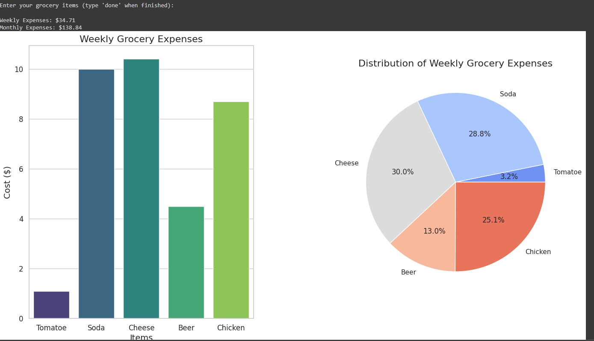

```markdown
# FrequencyShop - Grocery Expense Dashboard

FrequencyShop is an interactive Python tool designed to help you manage and optimize your grocery expenses. With features to input data via the console, calculate and visualize expenses, and reset data, this tool offers a comprehensive solution for personal budgeting.

## Table of Contents
- [Features](#features)
- [Requirements](#requirements)
- [Getting Started](#getting-started)
- [Usage](#usage)
- [Screenshots](#screenshots)
- [Contributing](#contributing)
- [License](#license)

## Features

- **Interactive Console Input:** Enter your grocery items, prices, and purchase frequencies directly from the console.
- **Expense Calculations:** Automatically calculate weekly and monthly grocery expenses based on your input data.
- **Dashboard Visualization:** View your expenses with both bar charts and pie charts in a clean, professional dashboard layout.
- **Data Reset:** Easily reset your data to start over with a new set of grocery items and prices.
- **Enhanced Visuals:** Well-spaced and aesthetically designed charts for better financial insights.

## Requirements

- Python 3.x
- NumPy
- Matplotlib
- Seaborn
- Pandas

## Getting Started

1. **Clone the Repository:**

   ```bash
   git clone https://github.com/yourusername/frequencyshop.git
   ```

2. **Install the Required Python Libraries:**

   ```bash
   pip install numpy matplotlib seaborn pandas
   ```

3. **Run the Script:**

   Navigate to the directory containing `frequencyshop.py` and run:

   ```bash
   python frequencyshop.py
   ```

4. **Follow the Console Prompts:**

   - Enter your grocery items, their prices, and purchase frequencies when prompted.
   - The script will calculate your weekly and monthly expenses and generate visualizations.
   - Use the options to reset your data or exit the program.

## Usage

Upon running the script, you will be prompted to input the following:

- **Item Name:** Enter the name of the grocery item.
- **Price:** Enter the price of the item.
- **Frequency:** Enter how many times you buy the item per week.

You can type `'done'` to finish entering items. After inputting the data, the script will display:

- Weekly and monthly expenses.
- A bar chart showing weekly expenses.
- A pie chart visualizing the distribution of expenses.

## Screenshots

Add your screenshots here   to showcase the dashboard and visualizations. For example:



## Contributing

Contributions are welcome! If you'd like to contribute to this project, please follow these steps:

1. Fork the repository.
2. Create a new branch for your feature or bug fix:

   ```bash
   git checkout -b feature-name
   ```

3. Make your changes and commit them:

   ```bash
   git commit -m "Add new feature"
   ```

4. Push to your fork:

   ```bash
   git push origin feature-name
   ```

5. Create a pull request to the original repository.

## License

This project is licensed under the MIT License.

Feel free to reach out if you have any questions or need assistance with using FrequencyShop.
```